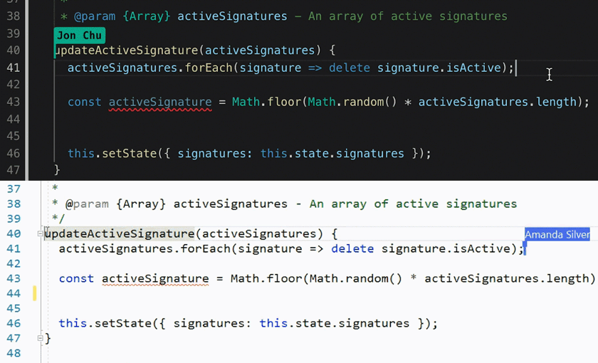
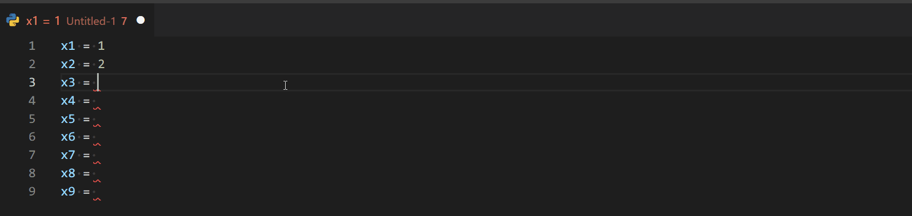

# オススメVS Code拡張機能

##  [Live Share](https://marketplace.visualstudio.com/items?itemName=MS-vsliveshare.vsliveshare-pack)
共同編集ができる拡張機能です。
ペアプログラミングに効果的かつ、その為の音声通話やチャット等も備わっている優れもの！
git/microsoftアカウントで簡単に始められます。
(通信環境の良いところで行ってください)

### 動作イメージ

### 参考URL
[VisualStudioとVSCodeのLiveShare機能を使ってみよう | ｗ２ソリューション株式会社 TECH Media](https://www.w2solution.co.jp/tech/2021/04/26/visualstudio%E3%81%A8vscode%E3%81%AEliveshare%E6%A9%9F%E8%83%BD%E3%82%92%E4%BD%BF%E3%81%A3%E3%81%A6%E3%81%BF%E3%82%88%E3%81%86/)

## [vscode-input-sequence](https://marketplace.visualstudio.com/items?itemName=tomoki1207.vscode-input-sequence)
`(1,2,3,4,...100)`のような連番を振りたいと思ったことはありませんか？
**vscode-input-sequence**は、通常のVS Codeでは出来ない連番の作成を行う拡張機能です。
起動方法は、コマンドパレットを開いて`sequence`と入力するだけ！
面倒な連番におさらばしましょう(*´꒳`*)

### 動作イメージ

### 参考URL
[Visual Studio Codeのデフォルトではできない連番を入力するには？ - オン香講師の将棋教室以外の話](https://オンライン将棋教室・香.com/instructor-blog/200622visual-studio-code-input-sequence/v)
