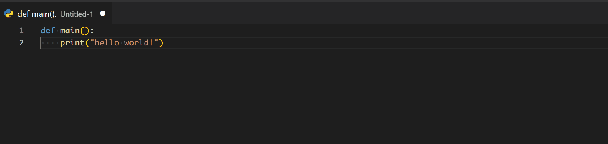
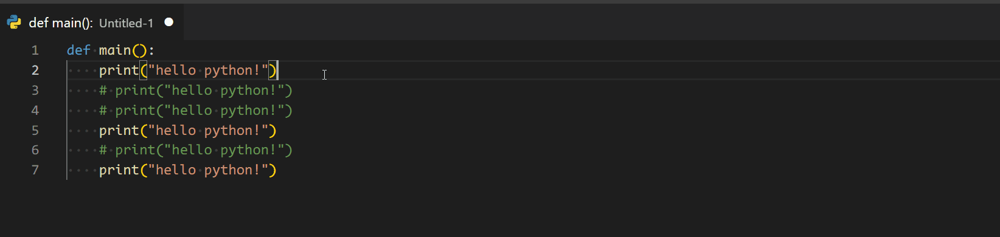
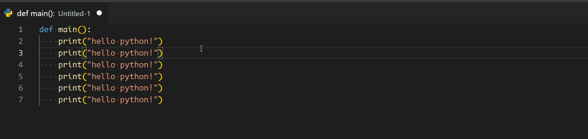
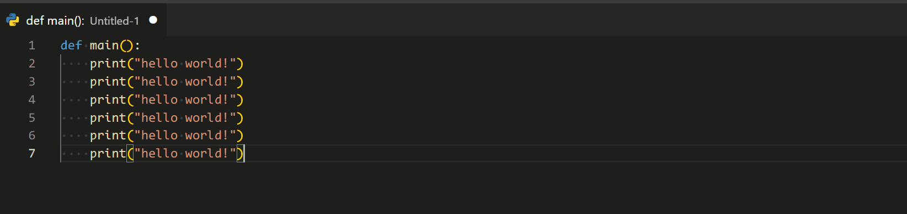

# かなり使える！ VS Codeショートカット

## 目次
- [かなり使える！ VS Codeショートカット](#かなり使える-vs-codeショートカット)
  - [全体](#全体)
    - [コマンドパレットの表示](#コマンドパレットの表示)
  - [編集系](#編集系)
    - [行の移動](#行の移動)
    - [行のコピー](#行のコピー)
    - [コメントアウト/アンコメント](#コメントアウトアンコメント)
    - [カーソルのコピー](#カーソルのコピー)

## 全体

### コマンドパレットの表示
#### ショートカット
`⌘ + Shift + P`
`F1`

#### 使い道
多くの機能を呼び出せるショートカットです。  
`Upper`と打てば選択範囲を全て大文字にできますし、スニペットの登録等でも使用します！  

## 編集系

### 行の移動
#### ショートカット
`⌥ + ↑/↓`

#### 使い道
コードを書いていて、処理の順序を入れ替えたいことがあるはずです。  
そんなときにこのショートカットを用いれば、容易にそれを実現できます！  
`選択→切り取り→貼り付け`とはおさらばしましょう。  

### 行のコピー
#### ショートカット
`⌥ + ⇧ + ↑/↓`

#### 使い道
上述のショートカットに`⇧`を加えたものです。  
似た行を書く際に重宝します。  
実は、このファイルの作成にも多用しています。  

### コメントアウト/アンコメント
#### ショートカット
`⌘ + /`

#### 使い道
プログラムを書く際、コメントアウトを多用するはずです。(デバッグ用関数やコメントの追加)  
しかし、プログラムによって記法が異なりますし、行を囲むのは工数が必要です。  
これを使用して、効率をあげてみませんか？  

### カーソルのコピー
#### ショートカット
`⌥ + ⌘ + ↑/↓`

#### 使い道
複数行の同時編集でよく使用するショートカットです。  
時には、コピーした複数行のテキストを一括で貼り付けるのにも使用します。  
[vscode-input-sequence](../1.Extensions/README.md#vscode-input-sequence)と組み合わせれば、連番の変数も瞬時に作成できますよ！  

